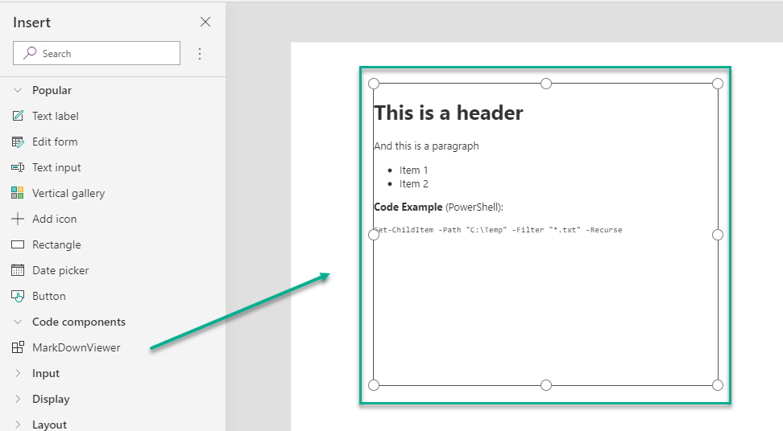

# PCF-MarkDownViewer

**[MIT License](LICENSE)**

MarkDown Viewer for PowerApps is a PCF Component to visualize [MarkDown](https://en.wikipedia.org/wiki/Markdown) content well formatted in your PowerApps.



## Properties

|Name|Description|Example|
|-|-|-|
|Content|The MarkDown content as text.|`# Header 1 **strong *italic* content**`|
|FontSize|CSS Font Size|`x-large`, `xx-large`, `x-small`, `xx-small`, ... |
|Overflow|The CSS scrollbar behavior for the control.|`auto` or `scroll`|

## Getting Started

Clone the repository and open the command prompt in folder `"src/MarkDownViewer"`. To retrieve all the required project dependencies, run the command:

```cmd
npm install
```

### Package a the component

Follow the [instructions](https://docs.microsoft.com/en-us/powerapps/developer/component-framework/import-custom-controls) and open the **Visual Studio Developer Command Prompt** in folder `"src/solution"`. Run the command:

```cmd
msbuild /t:build /restore
```

To install the component in your solution [connect your environment](https://docs.microsoft.com/en-us/powerapps/developer/component-framework/import-custom-controls#connecting-to-your-environment).

## Used Packages & Libraries

* [react](https://www.npmjs.com/package/react)
* [react-markdown](https://www.npmjs.com/package/react-markdown)
